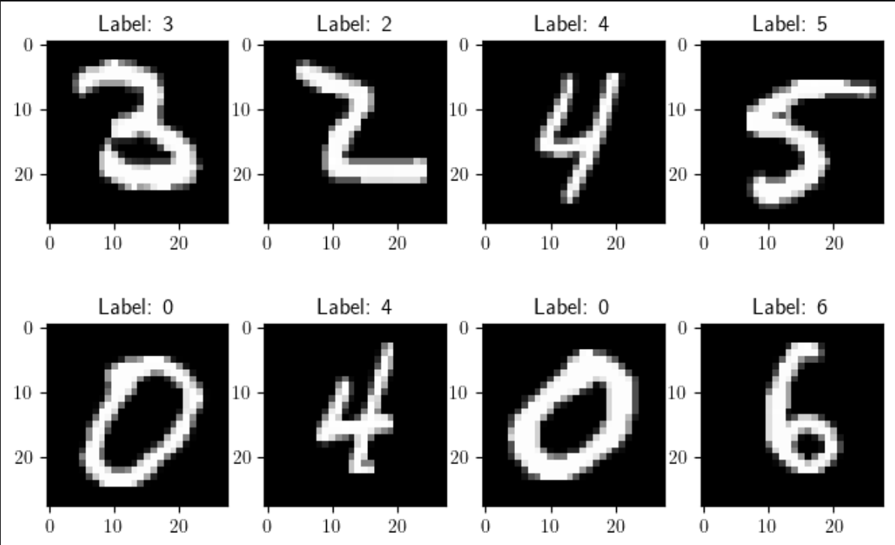
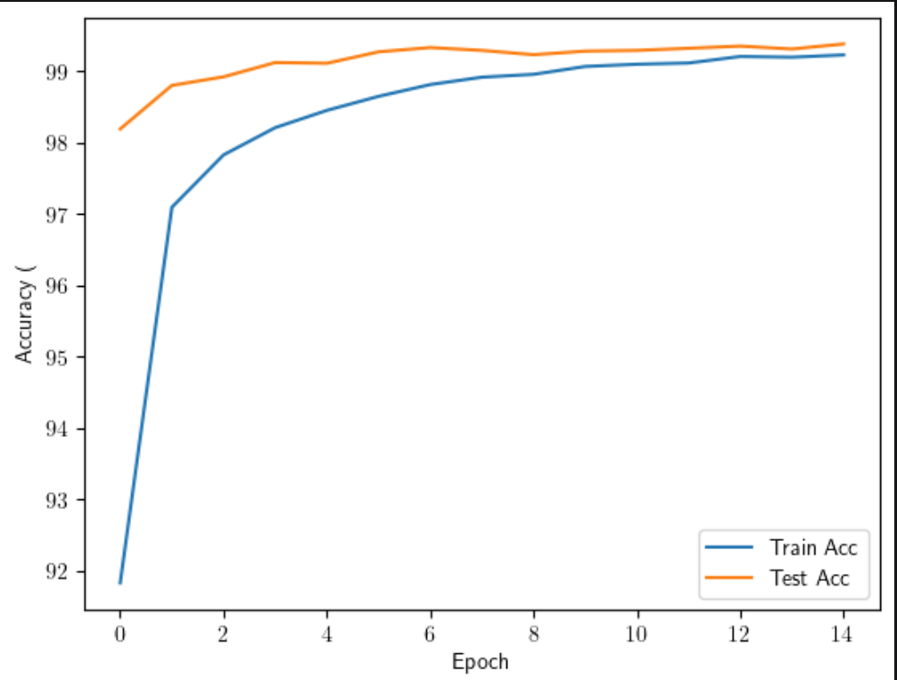
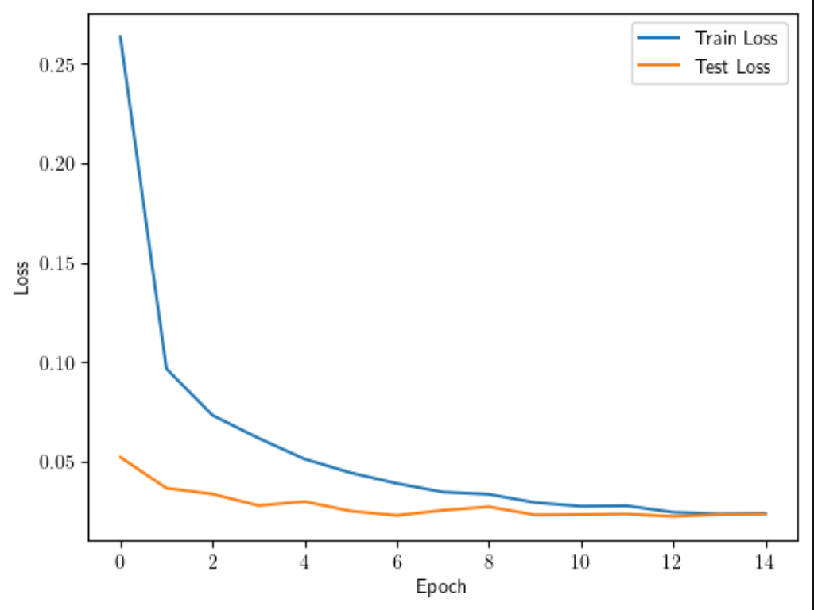
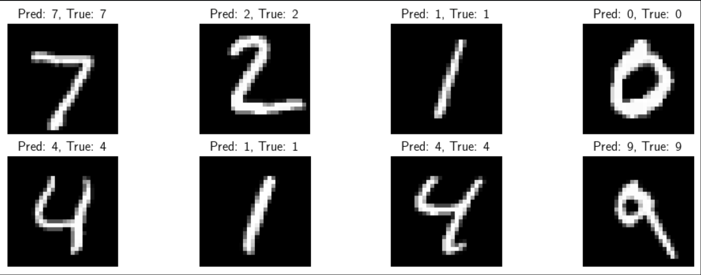

# MNIST Image Classification with CNN

This project implements a Convolutional Neural Network (CNN) for handwritten digit classification using the **MNIST dataset** and **PyTorch**.

## Dataset

The MNIST dataset is a large collection of handwritten digit images. It contains **60,000 training images** and **10,000 test images**.

Each image is a grayscale image with a resolution of **28 × 28 pixels**. The dataset contains **10 classes**, representing the digits from 0 to 9.

### MNIST Dataset

Here are some examples from the MNIST dataset used in this project:



## CNN Model

A Convolutional Neural Network was designed to classify the handwritten digits.

The model consists of two convolutional layers, two max-pooling layers, and fully connected layers.

```text
Input: 1 × 28 × 28

Conv2D: 1 → 32
ReLU
MaxPool

Conv2D: 32 → 64
ReLU
MaxPool

Flatten

Fully Connected: 3136 → 128
ReLU
Dropout: 0.5

Fully Connected: 128 → 10
```

## Training

The model was trained using the following configuration:

* Loss Function: Cross Entropy Loss
* Optimizer: Adam
* Learning Rate: 0.001
* Weight Decay: 1e-4
* Batch Size: 64
* Number of Epochs: 15
* GPU: CUDA when available

## Results

The model performance was monitored during training using both accuracy and loss.

### Accuracy vs Epoch

The following figure shows the training and test accuracy over the training epochs.



### Loss Function

The following figure shows the training and test loss during training.



## Prediction

After training, the model was evaluated on unseen test images.

The following figure shows the predicted digit and the corresponding true label for each test image.



## Technologies

* Python
* PyTorch
* Torchvision
* NumPy
* Matplotlib
* tqdm

## Project Structure

```text
MNIST-Image-Classification/
│
├── mnist_cnn.py
├── README.md
│
└── images/
    ├── MNIST_dataset.png
    ├── Accurace_vs_epoch.png
    ├── Loss_function.png
    └── Predicted.png
```

## Installation

```bash
git clone https://github.com/Aminreza404/MNIST-Image-Classification.git
cd MNIST-Image-Classification
pip install numpy matplotlib torch torchvision tqdm
```

## Run

```bash
python mnist_cnn.py
```

The MNIST dataset will be downloaded automatically if it is not already available.

